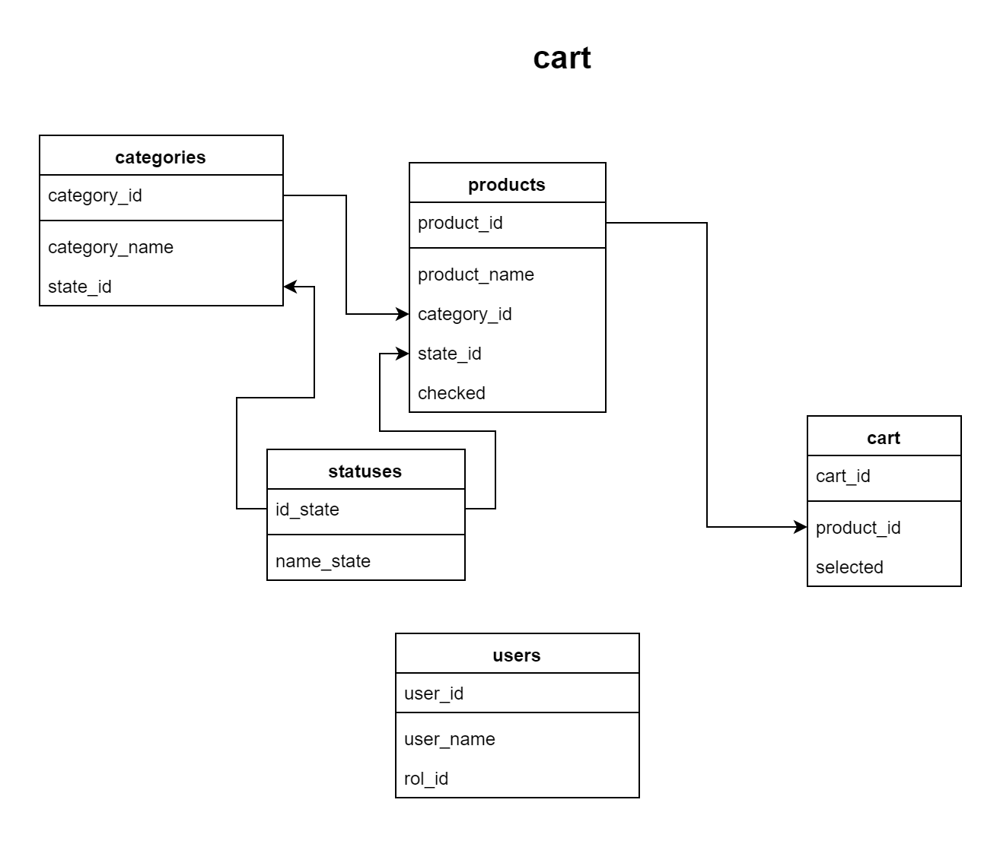

# Shopping-list is a project with learning porpose

## You can visit the API at this link [https://cart.cyclic.app/]

### First Steps

- Open a console and clone this [repository](https://github.com/lucesitaliss/shopping-list-back-end)
- if you want to use the api on localhost, run npm install, npm start and change the api.js file by assigning "development" to the projectStatus variable.
- This project runs on localhost on port 4000.

### Technological stack

- Node
- Express
- PostgreSQL

## ER Diagram



## SQL Scripts

```SQL
CREATE TABLE statuses (
    id_state SERIAL PRIMARY KEY,
    name_state VARCHAR (255)
);

CREATE TABLE categories(
    category_id SERIAL PRIMARY KEY,
    category_name VARCHAR(255),
    state_id integer REFERENCES statuses (id_state)
);

CREATE TABLE products(
    product_id SERIAL PRIMARY KEY,
    product_name VARCHAR(255),
    category_id integer REFERENCES categories(category_id),
    state_id integer REFERENCES statuses (id_state)
    checked boolean
);

CREATE TABLE users(
    user_id SERIAL PRIMARY key,
    user_name VARCHAR(255) UNIQUE,
    rol_id integer REFERENCES rol(id_rol),
    password  VARCHAR(255)
);

CREATE TABLE cart(
    cart_id SERIAL PRIMARY KEY,
    product_id integer REFERENCES products (product_id),
    selected boolean
);

ALTER TABLE cart ADD COLUMN selected boolean default false;

```
